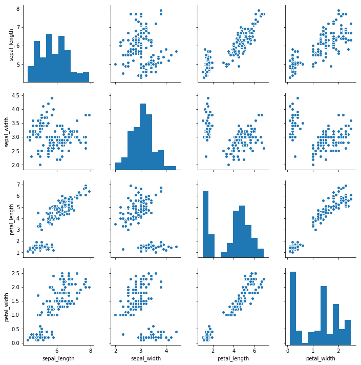
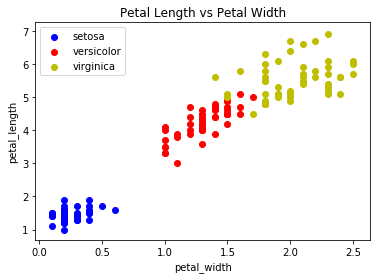
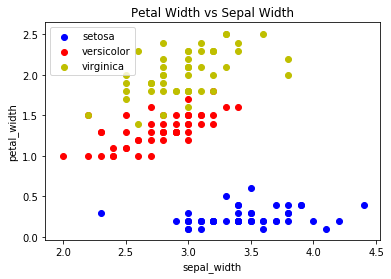
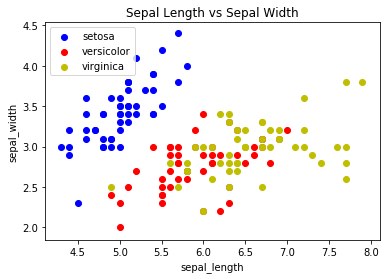

## A Quick guide to Data Analysis, Visualization and Multiclass Logistic Regression
### Arturo Torres


I will format this notebook as a quick guide to Data Analysis for an introductory audience. Luckily many Data Science libraries in Python have built in datasets that have been preprocessed for the convenience of the user. In this Notebook I will explore the Iris data set from the Seaborn library.


##### Part 1.1
First we'll import the standard library’s; many of which are can be found in any Python script related to Data Science:


```python
import pandas as pd
import numpy as np
import seaborn as sns
import matplotlib.pyplot as plt
% matplotlib inline
```

##### Part 1.2
Using the Seaborn library to import the Iris data set and saving it to a variable named iris_data; the data is imported as a Pandas DataFrame.


```python
iris_data = sns.load_dataset('iris')
iris_data
```


<div>
<style scoped>
    .dataframe tbody tr th:only-of-type {
        vertical-align: middle;
    }

    .dataframe tbody tr th {
        vertical-align: top;
    }

    .dataframe thead th {
        text-align: right;
    }
</style>
<table border="1" class="dataframe">
  <thead>
    <tr style="text-align: right;">
      <th></th>
      <th>sepal_length</th>
      <th>sepal_width</th>
      <th>petal_length</th>
      <th>petal_width</th>
      <th>species</th>
    </tr>
  </thead>
  <tbody>
    <tr>
      <th>0</th>
      <td>5.1</td>
      <td>3.5</td>
      <td>1.4</td>
      <td>0.2</td>
      <td>setosa</td>
    </tr>
    <tr>
      <th>1</th>
      <td>4.9</td>
      <td>3.0</td>
      <td>1.4</td>
      <td>0.2</td>
      <td>setosa</td>
    </tr>
    <tr>
      <th>2</th>
      <td>4.7</td>
      <td>3.2</td>
      <td>1.3</td>
      <td>0.2</td>
      <td>setosa</td>
    </tr>
    <tr>
      <th>3</th>
      <td>4.6</td>
      <td>3.1</td>
      <td>1.5</td>
      <td>0.2</td>
      <td>setosa</td>
    </tr>
    <tr>
      <th>4</th>
      <td>5.0</td>
      <td>3.6</td>
      <td>1.4</td>
      <td>0.2</td>
      <td>setosa</td>
    </tr>
    <tr>
      <th>5</th>
      <td>5.4</td>
      <td>3.9</td>
      <td>1.7</td>
      <td>0.4</td>
      <td>setosa</td>
    </tr>
    <tr>
      <th>6</th>
      <td>4.6</td>
      <td>3.4</td>
      <td>1.4</td>
      <td>0.3</td>
      <td>setosa</td>
    </tr>
    <tr>
      <th>7</th>
      <td>5.0</td>
      <td>3.4</td>
      <td>1.5</td>
      <td>0.2</td>
      <td>setosa</td>
    </tr>
    <tr>
      <th>8</th>
      <td>4.4</td>
      <td>2.9</td>
      <td>1.4</td>
      <td>0.2</td>
      <td>setosa</td>
    </tr>
    <tr>
      <th>9</th>
      <td>4.9</td>
      <td>3.1</td>
      <td>1.5</td>
      <td>0.1</td>
      <td>setosa</td>
    </tr>
    <tr>
      <th>10</th>
      <td>5.4</td>
      <td>3.7</td>
      <td>1.5</td>
      <td>0.2</td>
      <td>setosa</td>
    </tr>
    <tr>
      <th>11</th>
      <td>4.8</td>
      <td>3.4</td>
      <td>1.6</td>
      <td>0.2</td>
      <td>setosa</td>
    </tr>
    <tr>
      <th>12</th>
      <td>4.8</td>
      <td>3.0</td>
      <td>1.4</td>
      <td>0.1</td>
      <td>setosa</td>
    </tr>
    <tr>
      <th>13</th>
      <td>4.3</td>
      <td>3.0</td>
      <td>1.1</td>
      <td>0.1</td>
      <td>setosa</td>
    </tr>
    <tr>
      <th>14</th>
      <td>5.8</td>
      <td>4.0</td>
      <td>1.2</td>
      <td>0.2</td>
      <td>setosa</td>
    </tr>
    <tr>
      <th>15</th>
      <td>5.7</td>
      <td>4.4</td>
      <td>1.5</td>
      <td>0.4</td>
      <td>setosa</td>
    </tr>
    <tr>
      <th>16</th>
      <td>5.4</td>
      <td>3.9</td>
      <td>1.3</td>
      <td>0.4</td>
      <td>setosa</td>
    </tr>
    <tr>
      <th>17</th>
      <td>5.1</td>
      <td>3.5</td>
      <td>1.4</td>
      <td>0.3</td>
      <td>setosa</td>
    </tr>
    <tr>
      <th>18</th>
      <td>5.7</td>
      <td>3.8</td>
      <td>1.7</td>
      <td>0.3</td>
      <td>setosa</td>
    </tr>
    <tr>
      <th>19</th>
      <td>5.1</td>
      <td>3.8</td>
      <td>1.5</td>
      <td>0.3</td>
      <td>setosa</td>
    </tr>
    <tr>
      <th>20</th>
      <td>5.4</td>
      <td>3.4</td>
      <td>1.7</td>
      <td>0.2</td>
      <td>setosa</td>
    </tr>
    <tr>
      <th>21</th>
      <td>5.1</td>
      <td>3.7</td>
      <td>1.5</td>
      <td>0.4</td>
      <td>setosa</td>
    </tr>
    <tr>
      <th>22</th>
      <td>4.6</td>
      <td>3.6</td>
      <td>1.0</td>
      <td>0.2</td>
      <td>setosa</td>
    </tr>
    <tr>
      <th>23</th>
      <td>5.1</td>
      <td>3.3</td>
      <td>1.7</td>
      <td>0.5</td>
      <td>setosa</td>
    </tr>
    <tr>
      <th>24</th>
      <td>4.8</td>
      <td>3.4</td>
      <td>1.9</td>
      <td>0.2</td>
      <td>setosa</td>
    </tr>
    <tr>
      <th>25</th>
      <td>5.0</td>
      <td>3.0</td>
      <td>1.6</td>
      <td>0.2</td>
      <td>setosa</td>
    </tr>
    <tr>
      <th>26</th>
      <td>5.0</td>
      <td>3.4</td>
      <td>1.6</td>
      <td>0.4</td>
      <td>setosa</td>
    </tr>
    <tr>
      <th>27</th>
      <td>5.2</td>
      <td>3.5</td>
      <td>1.5</td>
      <td>0.2</td>
      <td>setosa</td>
    </tr>
    <tr>
      <th>28</th>
      <td>5.2</td>
      <td>3.4</td>
      <td>1.4</td>
      <td>0.2</td>
      <td>setosa</td>
    </tr>
    <tr>
      <th>29</th>
      <td>4.7</td>
      <td>3.2</td>
      <td>1.6</td>
      <td>0.2</td>
      <td>setosa</td>
    </tr>
    <tr>
      <th>...</th>
      <td>...</td>
      <td>...</td>
      <td>...</td>
      <td>...</td>
      <td>...</td>
    </tr>
    <tr>
      <th>120</th>
      <td>6.9</td>
      <td>3.2</td>
      <td>5.7</td>
      <td>2.3</td>
      <td>virginica</td>
    </tr>
    <tr>
      <th>121</th>
      <td>5.6</td>
      <td>2.8</td>
      <td>4.9</td>
      <td>2.0</td>
      <td>virginica</td>
    </tr>
    <tr>
      <th>122</th>
      <td>7.7</td>
      <td>2.8</td>
      <td>6.7</td>
      <td>2.0</td>
      <td>virginica</td>
    </tr>
    <tr>
      <th>123</th>
      <td>6.3</td>
      <td>2.7</td>
      <td>4.9</td>
      <td>1.8</td>
      <td>virginica</td>
    </tr>
    <tr>
      <th>124</th>
      <td>6.7</td>
      <td>3.3</td>
      <td>5.7</td>
      <td>2.1</td>
      <td>virginica</td>
    </tr>
    <tr>
      <th>125</th>
      <td>7.2</td>
      <td>3.2</td>
      <td>6.0</td>
      <td>1.8</td>
      <td>virginica</td>
    </tr>
    <tr>
      <th>126</th>
      <td>6.2</td>
      <td>2.8</td>
      <td>4.8</td>
      <td>1.8</td>
      <td>virginica</td>
    </tr>
    <tr>
      <th>127</th>
      <td>6.1</td>
      <td>3.0</td>
      <td>4.9</td>
      <td>1.8</td>
      <td>virginica</td>
    </tr>
    <tr>
      <th>128</th>
      <td>6.4</td>
      <td>2.8</td>
      <td>5.6</td>
      <td>2.1</td>
      <td>virginica</td>
    </tr>
    <tr>
      <th>129</th>
      <td>7.2</td>
      <td>3.0</td>
      <td>5.8</td>
      <td>1.6</td>
      <td>virginica</td>
    </tr>
    <tr>
      <th>130</th>
      <td>7.4</td>
      <td>2.8</td>
      <td>6.1</td>
      <td>1.9</td>
      <td>virginica</td>
    </tr>
    <tr>
      <th>131</th>
      <td>7.9</td>
      <td>3.8</td>
      <td>6.4</td>
      <td>2.0</td>
      <td>virginica</td>
    </tr>
    <tr>
      <th>132</th>
      <td>6.4</td>
      <td>2.8</td>
      <td>5.6</td>
      <td>2.2</td>
      <td>virginica</td>
    </tr>
    <tr>
      <th>133</th>
      <td>6.3</td>
      <td>2.8</td>
      <td>5.1</td>
      <td>1.5</td>
      <td>virginica</td>
    </tr>
    <tr>
      <th>134</th>
      <td>6.1</td>
      <td>2.6</td>
      <td>5.6</td>
      <td>1.4</td>
      <td>virginica</td>
    </tr>
    <tr>
      <th>135</th>
      <td>7.7</td>
      <td>3.0</td>
      <td>6.1</td>
      <td>2.3</td>
      <td>virginica</td>
    </tr>
    <tr>
      <th>136</th>
      <td>6.3</td>
      <td>3.4</td>
      <td>5.6</td>
      <td>2.4</td>
      <td>virginica</td>
    </tr>
    <tr>
      <th>137</th>
      <td>6.4</td>
      <td>3.1</td>
      <td>5.5</td>
      <td>1.8</td>
      <td>virginica</td>
    </tr>
    <tr>
      <th>138</th>
      <td>6.0</td>
      <td>3.0</td>
      <td>4.8</td>
      <td>1.8</td>
      <td>virginica</td>
    </tr>
    <tr>
      <th>139</th>
      <td>6.9</td>
      <td>3.1</td>
      <td>5.4</td>
      <td>2.1</td>
      <td>virginica</td>
    </tr>
    <tr>
      <th>140</th>
      <td>6.7</td>
      <td>3.1</td>
      <td>5.6</td>
      <td>2.4</td>
      <td>virginica</td>
    </tr>
    <tr>
      <th>141</th>
      <td>6.9</td>
      <td>3.1</td>
      <td>5.1</td>
      <td>2.3</td>
      <td>virginica</td>
    </tr>
    <tr>
      <th>142</th>
      <td>5.8</td>
      <td>2.7</td>
      <td>5.1</td>
      <td>1.9</td>
      <td>virginica</td>
    </tr>
    <tr>
      <th>143</th>
      <td>6.8</td>
      <td>3.2</td>
      <td>5.9</td>
      <td>2.3</td>
      <td>virginica</td>
    </tr>
    <tr>
      <th>144</th>
      <td>6.7</td>
      <td>3.3</td>
      <td>5.7</td>
      <td>2.5</td>
      <td>virginica</td>
    </tr>
    <tr>
      <th>145</th>
      <td>6.7</td>
      <td>3.0</td>
      <td>5.2</td>
      <td>2.3</td>
      <td>virginica</td>
    </tr>
    <tr>
      <th>146</th>
      <td>6.3</td>
      <td>2.5</td>
      <td>5.0</td>
      <td>1.9</td>
      <td>virginica</td>
    </tr>
    <tr>
      <th>147</th>
      <td>6.5</td>
      <td>3.0</td>
      <td>5.2</td>
      <td>2.0</td>
      <td>virginica</td>
    </tr>
    <tr>
      <th>148</th>
      <td>6.2</td>
      <td>3.4</td>
      <td>5.4</td>
      <td>2.3</td>
      <td>virginica</td>
    </tr>
    <tr>
      <th>149</th>
      <td>5.9</td>
      <td>3.0</td>
      <td>5.1</td>
      <td>1.8</td>
      <td>virginica</td>
    </tr>
  </tbody>
</table>
<p>150 rows × 5 columns</p>
</div>


##### Part 1.3

The Iris data set, or Fisher’s Iris data set, was introduced by the researcher Ronald Fisher in his paper **The Use of Multiple Measurements in Taxonomic Problems** in 1936. The data set contains the measurements of the plant's Sepal and Petal widths and lengths from three species of Iris. The ‘columns’ attribute can be used to see the possible covariates:


```python
iris_data.columns
```


    Index(['sepal_length', 'sepal_width', 'petal_length', 'petal_width',
           'species'],
          dtype='object')


##### Part 1.4 

An important prerequisite to an analysis is to gain familiarization with the data set. Pandas provides a plethora of useful function for this purpose, however in this notebook we’ll only use a few. To start we can take a peek at the first 5 rows of the data set by calling the ‘head’ function:


```python
iris_data.head()
```


<div>
<style scoped>
    .dataframe tbody tr th:only-of-type {
        vertical-align: middle;
    }

    .dataframe tbody tr th {
        vertical-align: top;
    }

    .dataframe thead th {
        text-align: right;
    }
</style>
<table border="1" class="dataframe">
  <thead>
    <tr style="text-align: right;">
      <th></th>
      <th>sepal_length</th>
      <th>sepal_width</th>
      <th>petal_length</th>
      <th>petal_width</th>
      <th>species</th>
    </tr>
  </thead>
  <tbody>
    <tr>
      <th>0</th>
      <td>5.1</td>
      <td>3.5</td>
      <td>1.4</td>
      <td>0.2</td>
      <td>setosa</td>
    </tr>
    <tr>
      <th>1</th>
      <td>4.9</td>
      <td>3.0</td>
      <td>1.4</td>
      <td>0.2</td>
      <td>setosa</td>
    </tr>
    <tr>
      <th>2</th>
      <td>4.7</td>
      <td>3.2</td>
      <td>1.3</td>
      <td>0.2</td>
      <td>setosa</td>
    </tr>
    <tr>
      <th>3</th>
      <td>4.6</td>
      <td>3.1</td>
      <td>1.5</td>
      <td>0.2</td>
      <td>setosa</td>
    </tr>
    <tr>
      <th>4</th>
      <td>5.0</td>
      <td>3.6</td>
      <td>1.4</td>
      <td>0.2</td>
      <td>setosa</td>
    </tr>
  </tbody>
</table>
</div>


At first glance we can see that the data set contains four columns with numerical values, these can be used to find patterns in the data; Because the data set contains a column ‘species’ with categorical variables, it looks like we can build a model to classify our categorical values: species. To confirm our suspicions on the data we'll call the function 'info'


```python
iris_data.info()
```

    <class 'pandas.core.frame.DataFrame'>
    RangeIndex: 150 entries, 0 to 149
    Data columns (total 5 columns):
    sepal_length    150 non-null float64
    sepal_width     150 non-null float64
    petal_length    150 non-null float64
    petal_width     150 non-null float64
    species         150 non-null object
    dtypes: float64(4), object(1)
    memory usage: 5.9+ KB


The ‘info’ function summarizes that data set. We can see that the data set contains 5 columns in total, 4 of which are of type ‘float64’ and one column of type object. To see the type of data within the *'species'* column, we can extract the first entry from *'species'*  by calling the iloc function (integer location) and extract the first entry from the DataFrame :


```python
type(iris_data[['species']].iloc[0, 0])
```


    str


To see how many unique values:


```python
iris_data['species'].unique()
```


    array(['setosa', 'versicolor', 'virginica'], dtype=object)


Also, since we know that we have 4 columns of type float64, calling the 'describe' function returns a few summary statistics in regards to these columns that might be useful :


```python
iris_data.describe()
```


<div>
<style scoped>
    .dataframe tbody tr th:only-of-type {
        vertical-align: middle;
    }

    .dataframe tbody tr th {
        vertical-align: top;
    }

    .dataframe thead th {
        text-align: right;
    }
</style>
<table border="1" class="dataframe">
  <thead>
    <tr style="text-align: right;">
      <th></th>
      <th>sepal_length</th>
      <th>sepal_width</th>
      <th>petal_length</th>
      <th>petal_width</th>
    </tr>
  </thead>
  <tbody>
    <tr>
      <th>count</th>
      <td>150.000000</td>
      <td>150.000000</td>
      <td>150.000000</td>
      <td>150.000000</td>
    </tr>
    <tr>
      <th>mean</th>
      <td>5.843333</td>
      <td>3.057333</td>
      <td>3.758000</td>
      <td>1.199333</td>
    </tr>
    <tr>
      <th>std</th>
      <td>0.828066</td>
      <td>0.435866</td>
      <td>1.765298</td>
      <td>0.762238</td>
    </tr>
    <tr>
      <th>min</th>
      <td>4.300000</td>
      <td>2.000000</td>
      <td>1.000000</td>
      <td>0.100000</td>
    </tr>
    <tr>
      <th>25%</th>
      <td>5.100000</td>
      <td>2.800000</td>
      <td>1.600000</td>
      <td>0.300000</td>
    </tr>
    <tr>
      <th>50%</th>
      <td>5.800000</td>
      <td>3.000000</td>
      <td>4.350000</td>
      <td>1.300000</td>
    </tr>
    <tr>
      <th>75%</th>
      <td>6.400000</td>
      <td>3.300000</td>
      <td>5.100000</td>
      <td>1.800000</td>
    </tr>
    <tr>
      <th>max</th>
      <td>7.900000</td>
      <td>4.400000</td>
      <td>6.900000</td>
      <td>2.500000</td>
    </tr>
  </tbody>
</table>
</div>


To get a visual representation of the relationships within the dataset, Seaborn has a convenient function “pairplot” that plots on the x axis each column and on the y axis a corresponding covariate. This is useful for finding visual relationships between covariates within the data set :


```python
sns.pairplot(iris_data)
```


    <seaborn.axisgrid.PairGrid at 0x10b2c5b38>





The pair plot shows a strong relationship between ‘petal_length’ and ‘petal_width’, ‘sepall_length’ and ‘petal_width’, ‘sepal_length’, and ‘petal_length’. This is an important information, if we were to run a Linear Regression on this data set, there would be a high rate of collinearity between covariates and therefore violating the BLUE assumptions of Linear Regression making the analysis statistically weak.

#### Part 1.5

A good analysis strategy would be to run a classification algorithm that will take as inputs measurements of the iris species and return a prediction of what specie of Iris it is. From the plots above, there are indications of clusters. For instance, 'petal_length' and 'petal_width' have a clear divide. In this case one can argue that a certain specie of iris tends to have smaller 'petal_length" and smaller "petal_width." To see the plot we can divide the data set into 3 subsets corresponding to species of Irishen plot the results.


```python
# Dividing DataFrame into 3 with corresponding species 
setosa = iris_data[iris_data['species'] == 'setosa']
versicolor = iris_data[iris_data['species'] == 'versicolor']
virginica = iris_data[iris_data['species'] == 'virginica']

# plotting 1
fig = plt.figure()
ax1 = fig.add_subplot(111)
ax1.scatter(setosa.petal_width, setosa.petal_length ,c='b', label='setosa')
ax1.scatter(versicolor.petal_width, versicolor.petal_length , c='r', label='versicolor')
ax1.scatter(virginica.petal_width, virginica.petal_length , c='y', label='virginica')
plt.legend(loc='upper left')
plt.title('Petal Length vs Petal Width')
plt.ylabel('petal_length')
plt.xlabel('petal_width')
plt.show()
```





As it turns out, the specie with smallest 'petal_length' and 'petal_width' is the Setosa. Another cluster seems to occur with 'sepal_width' and 'petal_width' and 'sepal_length' and 'sepal_width':


```python
# plotting 2
fig = plt.figure()
ax1 = fig.add_subplot(111)
ax1.scatter(setosa.sepal_width, setosa.petal_width ,c='b', label='setosa')
ax1.scatter(versicolor.sepal_width, versicolor.petal_width , c='r', label='versicolor')
ax1.scatter(virginica.sepal_width, virginica.petal_width , c='y', label='virginica')
plt.legend(loc='upper left')
plt.title('Petal Width vs Sepal Width')
plt.ylabel('petal_width')
plt.xlabel('sepal_width')
plt.show()
```





```python
# plotting 3
fig = plt.figure()
ax1 = fig.add_subplot(111)
ax1.scatter(setosa.sepal_length, setosa.sepal_width ,c='b', label='setosa')
ax1.scatter(versicolor.sepal_length, versicolor.sepal_width , c='r', label='versicolor')
ax1.scatter(virginica.sepal_length, virginica.sepal_width , c='y', label='virginica')
plt.legend(loc='upper left')
plt.title('Sepal Length vs Sepal Width')
plt.ylabel('sepal_width')
plt.xlabel('sepal_length')
plt.show()
```





The clusters between the 'Versicoplor' and 'Virginica', while ambiguous, seem to exist. A simple way to classify these clusters is by means of lines that act as bounds separating each cluster. Given these lines we can later classify a data entry to a specie based on which side of the line the point lies in.

##### Part 2.1

Support Vector Machines (SVM) are very useful for small data sets. SVM's work by finding a line of best fit based off of an orthogonal Weight Vector that determines the classification boundary, in other words a line that classifies based on where a data point resides. Because a line can be written in matrix form 
$$W \cdot X + b_0= 0$$  

This is the line we are trying to find :


To find this line we need to maximize the distance from the "Support Vectors" to the decision boundary i.e :

$$\min \frac{||{w}||^2}{2}$$ 
given that $$y_n = (w^{T}*x_n + b) >= n$$

where $ n = 1, .., N$

This optimization can be done with Lagrange multipliers but gets complicated quickly. The Scikit Learn Module (sklearn) has an SVM classifier object that can run this classification algorithm without much hassle. First we'll start by importing the dependencies.


```python
from sklearn.model_selection import train_test_split
from sklearn import svm, metrics
from sklearn.metrics import classification_report, confusion_matrix
```

##### Part 2.2 & 2.3

Then we'll start with reformatting the data so that it works well with the classifier from sklearn. A basic SVM can only classify binary data so we will use a One vs All approach. We will have to build three classifiers where each have their own target classification and the rest are treated as 0 values. We'll start with classifying the "Virginica" category against Setosa and Versicolor. To do so we'll create an X_data variable that holds all numerical values of the Iris data set. Then we'll create a vector that holds all the indecies where "virginica" is an entry and encode all "virginica" entries as 1, all else as 0.


```python
# Data Frame without Species Column
X_data = iris_data.iloc[:, :-1]
# A column vector with 1 for "virginica" and 0 otherwise
y_virginica = np.array([iris_data.iloc[:, -1] == "virginica"]).astype(float).flatten()
```

Next we will use the "train_test_split" function from the sklearn library that sudo randomly separates the original data set into: 80% training data and 20% reserved to test the model.


```python
# Spliting data
X_train, X_test, y_train, y_test = train_test_split(X_data, y_virginica, test_size=0.2)
```

Next we'll create an SVM object and train it using the separated data from train_test_split


```python
# Initializing classifier object 
classifier = svm.SVC(kernel='linear')
classifier.fit(X_train, y_train)
```


    SVC(C=1.0, cache_size=200, class_weight=None, coef0=0.0,
      decision_function_shape='ovr', degree=3, gamma='auto', kernel='linear',
      max_iter=-1, probability=False, random_state=None, shrinking=True,
      tol=0.001, verbose=False)


##### Part 2.4

Now that the model is trained, we can pass in testing data to the 'predict' function; The predict function returns a vector of predicted values. I will also print the first 10 rows of a DataFrame that contains the testing labels and predicted labels side by side to get a feel of the level of accuracy the trained model has. Next the Confusion Matrix and Classification Report are printed for testing data.


```python
# Classification Accuracy from Testing Data
predicted = classifier.predict(X_test)
test = metrics.accuracy_score(y_test, predicted) * 100


print(pd.DataFrame(y_test, predicted).head(10))
print('\n')
print(confusion_matrix(y_test, predicted))
print(classification_report(y_test, predicted))

print('Testing Accuracy: ' + str(test))
```

           0
    1.0  1.0
    0.0  0.0
    0.0  0.0
    1.0  1.0
    1.0  1.0
    0.0  0.0
    0.0  0.0
    0.0  1.0
    1.0  0.0
    0.0  0.0
    
    
    [[17  2]
     [ 1 10]]
                 precision    recall  f1-score   support
    
            0.0       0.94      0.89      0.92        19
            1.0       0.83      0.91      0.87        11
    
    avg / total       0.90      0.90      0.90        30
    
    Testing Accuracy: 90.0


The confusion matrix, sometimes referred to as the error matrix, has the structure 


Where the columns are the predicted values and rows the actual values. This is an example for a binary classifier so the matrix will be of size 2x2. For this classifier, the SVM model classified the 17 "Non-virginica" instances correctly as "Non-virginica" and 10 "virginica" correctly. The Recall is the ratio between the total number of instances predicted correctly for a given class and the total number of class examples. The precision is the ratio of correctly classified instances for a given class and the total number of predicted values for a given class. The F1-score is the mean of both the precision and recall, it tries to provide a holistic measure of type 1 and type 2 errors through the precision and recall values. The support is simply the number of instances per class.

The results for this class are very good. Now we have to repeat for "Versicolor" and "Setosa":


```python
# Versicolor
y_versicolor = np.array([iris_data.iloc[:, -1] == "versicolor"]).astype(float).flatten()

# Spliting Data
X_train, X_test, y_train, y_test = train_test_split(X_data, y_versicolor, test_size=0.2)

# Initializing classifier object 
classifier = svm.SVC(kernel='linear')
classifier.fit(X_train, y_train)

# Classification Accuracy from Testing Data
predicted = classifier.predict(X_test)
test = metrics.accuracy_score(y_test, predicted) * 100

print(confusion_matrix(y_test, predicted))
print(classification_report(y_test, predicted))

print('Testing Accuracy: ' + str(test))
```

    [[19  2]
     [ 7  2]]
                 precision    recall  f1-score   support
    
            0.0       0.73      0.90      0.81        21
            1.0       0.50      0.22      0.31         9
    
    avg / total       0.66      0.70      0.66        30
    
    Testing Accuracy: 70.0


```python
# Setosa
y_setosa = np.array([iris_data.iloc[:, -1] == "setosa"]).astype(float).flatten()

# Spliting Data
X_train, X_test, y_train, y_test = train_test_split(X_data, y_setosa, test_size=0.2)

# Initializing classifier object 
classifier = svm.SVC(kernel='linear')
classifier.fit(X_train, y_train)

# Classification Accuracy from Testing Data
predicted = classifier.predict(X_test)
test = metrics.accuracy_score(y_test, predicted) * 100

print(confusion_matrix(y_test, predicted))
print(classification_report(y_test, predicted))

print('Testing Accuracy: ' + str(test))
```

    [[18  0]
     [ 0 12]]
                 precision    recall  f1-score   support
    
            0.0       1.00      1.00      1.00        18
            1.0       1.00      1.00      1.00        12
    
    avg / total       1.00      1.00      1.00        30
    
    Testing Accuracy: 100.0


The SVM model seems to work well for the 'Virginica' and 'Setosa' categories. This is because 'Virginica' and 'Setosa' tend to have clusters with distinct values, and are on the corners of the graphs, they, therefore, can classify well. 'Versicolor' is an interesting category, the Type 2 errors are 7 and Type 1 is 2. Because the Recall is the proportion of the correctly predicted over the total of a given label it's recall, for the right classification, is .22. The precision is not decent. The overlaps "Virginica" has with the "Versicolor" can explain this result.

## Logistic and Multiclass Logistic Regression  

A Logistic Regression can also be used to classify binary outcomes. The Logistic Regression model employs a sigmoid function to derive its classification and can be represented as a probability : 

$$P(y = C_1 | X) = \sigma{(W^T\cdot{x} + w_0)}$$

where $\sigma{(W^T\cdot{x} + w_0)}$ is the inverse Logit function:

$$\sigma{(W^T\cdot{x} + w_0)} = \frac{1}{1 + e^{-(W^T\cdot{x} + w_0)}}$$

We can include the extra $w_0$ within the $W$ matrix to account for the bias, or intercept weight component. For the posterior probability of another class:

$$P(y = C_2 | X) = 1-P(y = C_1 | X)$$

To get the likelihood we can use the Binomial Distribution, however we would have to use it for only two values:

$$P( Y | X) = \prod_{n=1}^{N}  (W^T\cdot{X})_{n}^{y_n}* (1 - (W^T\cdot{X})_{n})^{1-y_n}$$

To derive an error function for this likelihood function, a log transformation must be taken to change the product to a summation. From this a Gradient Decent optimization can be used to find the optimal weight vectors. To classify the Iris data set we need to build 3 individual classifiers using a One vs All approach.


The **Direct Multiclass Logistic Regression** allows for a more Bayesian approach when calculating the posterior probabilities for classification. With this approach to Logistic Regression only one gradient descent optimization is needed. Instead of using the Inverse Logit Function, the Multiclass Logistic Regression uses a Softmax Transformation :

$$P(y = C_k | X) = \frac{e^(W_k^T\cdot{x})}{\sum_{j=1}^{K}e^(W_j^T\cdot{x})}$$

If we commit to transforming the 'species' column to dummy variables then a likelihood function can be derived as :

$$ P(Y | w_1, ..., w_k) = \prod_{n=1}^{N}\prod_{k=1}^{K} P(y = C_k|X_n)^{y_{nk}} $$

where $Y$ is a matrix with dimensions $N\times K$ because of the dummy variable transformation. For gradient decent to work we need the Cross-Entropy Error Function. Appling a log to the Likelihood function allows for the removal of the products since summations are much easier for computers to work with :

$$ -\log(P(Y | w_1, ..., w_k))$$

$$ = - \sum_{n=1}^{N}\sum_{k=1}^{K} y_nk\log{(P(y = C_k | X))} $$ 

Next the gradient of the Log Likelihood function is needed to run the Gradient Descent:

$$ \frac{\partial}{\partial{W_k}}{[- \sum_{n=1}^{N}\sum_{k=1}^{K} y_nk\log{(P(y = C_k | X))}]}$$

$$ = \sum_{n=1}^{N}(P(y = C_k | X)_n - y_{nk})X_n$$

Weights Update Function for this Stochastic Gradient Decent is:

$$ W_{k, updated} = W_{k, prev} - \eta \frac{\partial}{\partial W_k}[\sum_{n=1}^{N}(P(y = C_k | X)_n - y_{nk})X_n]$$
Where $\eta$ is the Learning Rate

A far more detailed explanation can be found here: 
http://www.cedar.buffalo.edu/~srihari/CSE574/Chap4/4.3.4-MultiLogistic.pdf

Implementing the Posterior distribution, in this case the SoftMax Transformation 
$$P(y = C_k | X) = \frac{e^{(W_k^T\cdot{x})}}{\sum_{j=1}^{K}e^{(W_j^T\cdot{x})}}:$$


```python
def posteriorProb(W, data):
    """
    Calculates the posterior probability
    
    Keywords:
    W: Weight Vector
    data: the input data
    out: the Probability of the corresponding category from the weight vector
    """


    kth_weight = np.exp(np.dot(data, W))

    denominator = np.sum(np.exp(np.dot(data, W)), axis=1).reshape(len(data), 1)

    return kth_weight/denominator
```

Cross-Entropy Error function
$$ = - \sum_{n=1}^{N}\sum_{k=1}^{K} y_{nk}\log{(P(y = C_k | X))} :$$ 


```python
def crossEntropy(weight_vec, data, labels):
    """
    Returns the error value from the error function and the proability
    of the category occuring from a given weight matrix.
    
    Keywords:
    weight_vec: weight matrix for data set's features
    data: the input data
    out: Tuple with (Cross-Entroy Error, Posterior probability)
    """
    
    posterior = posteriorProb(weight_vec, data)
    
    return -np.sum(np.sum(np.multiply(labels, np.log(posterior)))), posterior
```

Gradient Function
$$ = \sum_{n=1}^{N}(P(y = C_k | X)_n - y_{nk})X_n:$$


```python
def gradient(data, labels, posterior):
    """
    Returns the weight matricies for each category. 
    
    Keywords:
    data: the input data
    labels: vector with corresponding labels from the given data
    posterior: probability of category occuring
    out: A vector with category weight vectors stacked in descending order
    """
    
    
    error_grad = (np.dot(data.T, np.subtract(posterior, labels)))

    return error_grad.reshape(error_grad.shape[0], error_grad.shape[1]).flatten()
```

The 'minimize' function from the Scipy Module can be used to find the optimal Weight vectors with Gradient Descent. The minimize function requires an Objective function and an initial Weight vector. The Objective function will calculate and return the error and error_gradient vector for a given iteration. Scipy will use these results to find an optimal Weight vector.


```python
def objective_Function(weights, *args):
    """
    Returns error value and the gradient of the Weight matricies. 
    
    Keywords:
    weights: Weights matricies
    args: traning data, training labels
    out: Cross-Entropy Error, gradient of Weight matricies 
    """
    
    data_matrix, label_vector = args
    n_data = data_matrix.shape[0]
    n_feature = data_matrix.shape[1]

    X_bias = np.hstack((np.ones((n_data,1)), data_matrix))
    weights = weights.reshape(n_feature + 1,n_class)  

    error, posterior = crossEntropy(weights, X_bias, label_vector)
    error_grad = gradient(X_bias, label_vector, posterior)
    
    
    return error, error_grad
```

Once the weight vector is returned, the prediction function will return the predicted values from a testing set.


```python
def prediction(W, data):
    """
    Returns Predicted value from testing data 
    
    Keywords:
    W: optimal Weight matrix learned
    data: testing data
    out: The most probable category from testing data
    """
    
    X_bias = np.hstack((np.ones((len(data), 1)), data))
    
    y_prob = np.argmax(posteriorProb(W, X_bias), axis=1)
    
    
    return y_prob.reshape(len(data), 1)
```

The complete implemintation:


```python
# Importing the minimize function
from scipy.optimize import minimize

# Encoding Species into numbers
encoded_labels = iris_data.iloc[:, -1].astype('category').cat.codes

# Spliting into testing and training sets
X_train, X_test, y_train, y_test = train_test_split(iris_data.iloc[:, :-1], encoded_labels, test_size=0.2)

# A few variables needed to reshape the matricies
n_feature = X_train.shape[1]
n_class = len(y_train.unique())
n_train = X_train.shape[0]
y_train = y_train.reshape(len(y_train), 1)
y_test = y_test.reshape(len(y_test), 1)

# Creating Dummy Variables
Y = np.zeros((n_train, n_class))
for i in range(n_class):
    Y[:, i] = (y_train == i).astype(int).ravel()

# All Weights initialized as 0
initial_Weights = np.zeros((n_feature + 1, n_class))

# Calling the minimize function
args = (X_train, Y)
params = minimize(objective_Function, initial_Weights, jac=True, args=args, method='CG')
weight_vector = params.x.reshape((n_feature + 1, n_class))

# Find the accuracy on Testing Dataset
predicted = prediction(weight_vector, X_test)


print(confusion_matrix(y_test, predicted))
print(classification_report(y_test, predicted))


print('\n Testing set Accuracy:' + str(100 * np.mean((predicted == y_test).astype(float))) + '%')
```

    [[ 7  0  0]
     [ 0 14  0]
     [ 0  0  9]]
                 precision    recall  f1-score   support
    
              0       1.00      1.00      1.00         7
              1       1.00      1.00      1.00        14
              2       1.00      1.00      1.00         9
    
    avg / total       1.00      1.00      1.00        30
    
    
     Testing set Accuracy:100.0%


    /Users/atorres/anaconda3/lib/python3.6/site-packages/ipykernel_launcher.py:14: FutureWarning: reshape is deprecated and will raise in a subsequent release. Please use .values.reshape(...) instead
      
    /Users/atorres/anaconda3/lib/python3.6/site-packages/ipykernel_launcher.py:15: FutureWarning: reshape is deprecated and will raise in a subsequent release. Please use .values.reshape(...) instead
      from ipykernel import kernelapp as app

